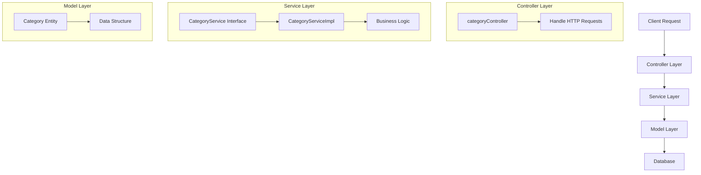

# SM E-commerce Application

This is a Spring Boot-based e-commerce application that follows a layered architecture pattern.

## Project Structure

```
src/main/java/com/ecommerce/sm_ecommerce/
├── controller/
│   └── categoryController.java
├── service/
│   ├── CategoryService.java
│   └── CategoryServiceImpl.java
├── model/
│   └── Category.java
└── SmEcommerceApplication.java
```

## Code Flow



## Architecture Overview

### 1. Controller Layer
- Located in `controller/` directory
- Handles HTTP requests and responses
- Main controller: `categoryController.java`
- Responsible for:
  - Request validation
  - Input processing
  - Response formatting

### 2. Service Layer
- Located in `service/` directory
- Contains business logic
- Components:
  - `CategoryService.java`: Interface defining service methods
  - `CategoryServiceImpl.java`: Implementation of service methods
- Responsible for:
  - Business logic implementation
  - Data processing
  - Transaction management

### 3. Model Layer
- Located in `model/` directory
- Contains entity classes
- Main entity: `Category.java`
- Responsible for:
  - Data structure definition
  - Entity relationships
  - Data validation

## Request Flow
1. Client sends HTTP request to the application
2. Request is received by the appropriate controller
3. Controller processes the request and calls relevant service methods
4. Service layer implements business logic
5. Model layer handles data structure and persistence
6. Response flows back through the layers to the client

## Technologies Used
- Spring Boot
- Java
- Maven (for dependency management)

## Getting Started
1. Clone the repository
2. Ensure you have Java and Maven installed
3. Run the application using:
   ```bash
   mvn spring-boot:run
   ```

## API Endpoints
The application provides RESTful endpoints for category management through the `categoryController`.
