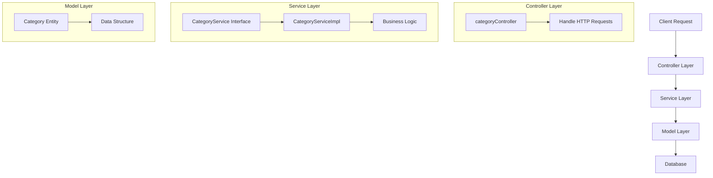

# SM E-commerce Application

This is a Spring Boot-based e-commerce application that follows a layered architecture pattern.

## Project Structure

```
src/main/java/com/ecommerce/sm_ecommerce/
├── controller/
│   └── categoryController.java
├── service/
│   ├── CategoryService.java
│   └── CategoryServiceImpl.java
├── model/
│   └── Category.java
└── SmEcommerceApplication.java
```

## Code Flow



## Architecture Overview

### 1. Controller Layer
- Located in `controller/` directory
- Handles HTTP requests and responses
- Main controller: `categoryController.java`
- Responsible for:
  - Request validation
  - Input processing
  - Response formatting

### 2. Service Layer
- Located in `service/` directory
- Contains business logic
- Components:
  - `CategoryService.java`: Interface defining service methods
  - `CategoryServiceImpl.java`: Implementation of service methods
- Responsible for:
  - Business logic implementation
  - Data processing
  - Transaction management

### 3. Model Layer
- Located in `model/` directory
- Contains entity classes
- Main entity: `Category.java`
- Responsible for:
  - Data structure definition
  - Entity relationships
  - Data validation

## Request Flow
1. Client sends HTTP request to the application
2. Request is received by the appropriate controller
3. Controller processes the request and calls relevant service methods
4. Service layer implements business logic
5. Model layer handles data structure and persistence
6. Response flows back through the layers to the client

## Technologies Used
- Spring Boot
- Java
- Maven (for dependency management)

## Getting Started
1. Clone the repository
2. Ensure you have Java and Maven installed
3. Run the application using:
   ```bash
   mvn spring-boot:run
   ```

## API Endpoints
TheApplication provides RESTful endpoints for category management through the `categoryController`.

## Interview Questions & Answers

### 1. What is the architecture pattern used in this project?
**Answer:** This project follows a layered architecture pattern with clear separation of concerns:
- **Controller Layer**: Handles HTTP requests/responses
- **Service Layer**: Contains business logic
- **Model Layer**: Manages data structure and persistence

### 2. Explain the purpose of @RestController and @RequestMapping annotations
**Answer:**
- `@RestController`: Combines `@Controller` and `@ResponseBody`, indicating that return values from methods are written directly to the HTTP response body.
- `@RequestMapping("/api")`: Maps all handler methods in the controller to URLs starting with "/api".

### 3. How does dependency injection work in this project?
**Answer:** The project uses Spring's `@Autowired` annotation for dependency injection. For example, `CategoryService` is injected into `CategoryController`, promoting loose coupling and easier testing.

### 4. Explain the role of ResponseEntity
**Answer:** `ResponseEntity` is used to represent the entire HTTP response including:
- Status code (200 OK, 201 CREATED, etc.)
- Headers
- Response body

### 5. What is the purpose of the CategoryService interface?
**Answer:** The `CategoryService` interface defines the contract for business operations related to categories. It follows the Interface Segregation Principle, making the code more maintainable and testable.

### 6. How would you handle exceptions in this application?
**Answer:** The project uses `ResponseStatusException` to handle exceptions with appropriate HTTP status codes. For example, when a category is not found, it returns a 404 status.

### 7. What is the significance of the @Transactional annotation?
**Answer:** `@Transactional` ensures that database operations within a method are atomic. If any operation fails, all changes are rolled back, maintaining data consistency.

### 8. How would you add validation to the Category model?
**Answer:** You can add validation annotations like `@NotBlank`, `@Size`, etc., to the Category class fields and use `@Valid` annotation in the controller method parameters.

### 9. Explain the difference between @Repository and @Service annotations
**Answer:**
- `@Repository`: Indicates that the class provides data access mechanism
- `@Service`: Indicates that the class contains business logic

### 10. How would you implement pagination for the category list?
**Answer:** You can modify the service method to accept `Pageable` parameter and use Spring Data JPA's built-in pagination support.

### 11. What is the purpose of the application.properties file?
**Answer:** `application.properties` contains configuration settings like:
- Database connection details
- Server port
- H2 console configuration
- JPA/Hibernate properties

### 12. How would you add logging to this application?
**Answer:** You can use SLF4J with Logback by adding `@Slf4j` annotation to classes and using `log.info()`, `log.error()`, etc.

### 13. What is the purpose of the @GeneratedValue annotation?
**Answer:** `@GeneratedValue` is used to specify the primary key generation strategy for the entity. In this project, it's used to auto-generate category IDs.

### 14. How would you add Swagger/OpenAPI documentation?
**Answer:** Add Springdoc OpenAPI dependency and configure it with `@OpenAPIDefinition` and `@Operation` annotations.

### 15. What is the purpose of the @RequestBody annotation?
**Answer:** `@RequestBody` binds the HTTP request body to a method parameter. It's used in POST/PUT methods to convert JSON/XML request body to Java objects.

### 16. How would you implement caching in this application?
**Answer:** You can use Spring's caching abstraction with `@Cacheable`, `@CacheEvict` annotations and configure a cache provider like Caffeine or Ehcache.

### 17. What is the difference between @PathVariable and @RequestParam?
**Answer:**
- `@PathVariable`: Extracts values from the URI path
- `@RequestParam`: Extracts query parameters from the URL

### 18. How would you secure the API endpoints?
**Answer:** You can use Spring Security to:
- Add authentication (JWT/OAuth2)
- Configure URL-based authorization
- Enable HTTPS
- Add CSRF protection

### 19. What is the purpose of the @Entity annotation?
**Answer:** `@Entity` marks a class as a JPA entity, which means it's a persistent domain object that represents a table in a database.

### 20. How would you write unit tests for the CategoryController?
**Answer:** Use `@WebMvcTest` for controller tests, `@MockBean` for dependencies, and MockMvc for making requests and verifying responses.
